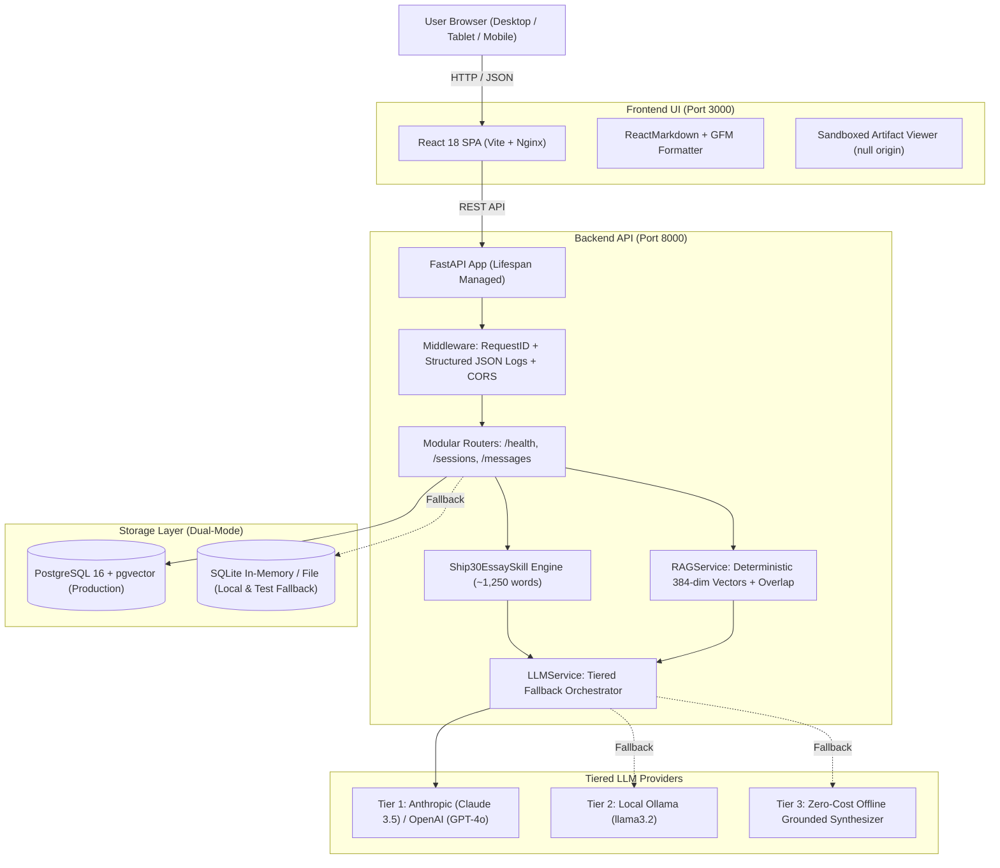

# ⚡ Lenny Growth Assistant

[-success?style=flat-square)](file:///tests)
[](https://python.org)
[](https://fastapi.tiangolo.com)
[](https://react.dev)
[](https://vitejs.dev)
[](https://docker.com)
[](file:///docs/design.md)

An internal AI intelligence platform that empowers product and growth teams to query tactical playbooks grounded strictly in **Lenny's Podcast transcripts**, synthesize actionable **Ship 30 for 30 style executive essays**, and inspect rendered Markdown and HTML artifacts side-by-side in a sandboxed split-pane workspace.

---

## 🏛️ System Architecture



---

## ✨ Key Capabilities

- **Strict Source Grounding:** Answers are backed by verifiable podcast transcript excerpts with clickable episode links, speaker attribution, and timestamp offsets (`[Episode Title, Timestamp]`).
- **Zero-Hallucination Guardrails:** If a question is outside the ingested episodes, the system explicitly states *"Based on Lenny's Podcast transcripts, this topic is not covered in the ingested episodes."*
- **Ship 30 for 30 Essay Skill:** Transforms grounded tactical answers into a formatted ~1,250-word digital writing essay with a punchy hook, narrative progression, skimmable bold pillars, and a single 24-hour actionable takeaway.
- **Dual-Pane Split Workspace:** View conversational Q&A and generated artifacts simultaneously without context switching.
- **Sandboxed Security Model:** HTML artifacts render inside an isolated iframe with `sandbox="allow-scripts"` and `null` origin, prohibiting access to host session storage or cookies.
- **Dual-Mode Persistence:** Runs on enterprise PostgreSQL + `pgvector` in Docker Compose, or automatically falls back to local SQLite (`lenny_growth.db`) for zero-dependency development and evaluation.
- **Tiered Resilience:** Automatically cascades: Cloud API (Claude/GPT-4) $\rightarrow$ Local Ollama $\rightarrow$ Grounded Offline Synthesizer.
- **Accessibility & Mobile First:** Fully keyboard-navigable (`WCAG 2.1 AA`), screen-reader friendly (`aria-live="polite"`), and mobile drawer responsive with touch backdrop.

---

## 🚀 Quickstart Guide

### Option A: Windows 1-Click Launch (Recommended for Evaluation)
No Docker daemon required. Launches backend and frontend simultaneously and opens your default browser:

```bat
double-click run.bat
```
* Or from PowerShell:
```powershell
.\run.bat
```
- **Frontend:** [http://localhost:3000](http://localhost:3000)
- **Backend Swagger API Docs:** [http://localhost:8000/docs](http://localhost:8000/docs)
- **Health Endpoint:** [http://localhost:8000/health](http://localhost:8000/health)

---

### Option B: Docker Compose (Full Multi-Container Production Topology)
Spins up PostgreSQL with pgvector, Ollama runtime, FastAPI backend, and Nginx-served React frontend:

```bash
# 1. Clone the repository
git clone https://github.com/your-org/oogway.git
cd oogway

# 2. Configure environment (optional, defaults run out of the box)
cp .env.example .env

# 3. Build and launch all services
docker compose up --build
```

---

## 🧪 Evaluator Handoff Walkthrough (5-Minute Evaluation)

To verify all system capabilities independently:

### Step 1: Verify System Health
Visit `http://localhost:8000/health` or run:
```bash
curl http://localhost:8000/health
```
You will receive a 200 OK status report indicating database operational status, provider readiness, and active configuration.

### Step 2: Test Grounded RAG Query
Open `http://localhost:3000` and click the starter prompt:
> *"What does Elena Verna recommend for building sustainable B2B PLG funnels?"*

**Expected Result:**
1. Conversational answer strictly citing Elena Verna's frameworks.
2. Structured expandable citation box: `📚 1+ Grounded Source Citations`.
3. Expand the citation to see the exact episode title, timestamp offset, similarity match score, and text excerpt.
4. Response telemetry badge displaying provider name and execution duration in milliseconds.

### Step 3: Test Ship 30 for 30 Essay Generation
Below the assistant's answer, click the **`✍️ Generate Ship 30 Essay`** button.

**Expected Result:**
1. The right split-pane opens automatically (`ArtifactViewer`).
2. Generates an executive ~1,250-word essay following the 4-part Ship 30 digital writing framework.
3. Switch between **Rendered View** and **Raw Source** tabs.
4. Test the **`📋 Copy`** and **`⬇️ Export`** buttons to download the essay as `.md`.

### Step 4: Test Out-of-Scope Zero-Hallucination Guardrail
Send a message about an unindexed domain:
> *"Explain quantum chromodynamics and gluon plasma physics."*

**Expected Result:**
The assistant returns:
> *"I searched Lenny's Podcast transcripts, but this specific topic is not substantially covered in the ingested episodes."*
Zero citations are fabricated.

---

## 🧪 Automated Test Suite

The test suite covers unit vector math, schema validation, RAG retrieval, session CRUD, and error handlers with **41 automated tests**:

```bash
cd backend
pytest ../tests -v --tb=short
```

**Test Breakdown:**
- `test_messages.py`: End-to-end conversational RAG, citation generation, history slicing.
- `test_essay.py`: Ship 30 essay skill execution, artifact creation, schema formatting.
- `test_retriever.py`: Deterministic 384-dim vector hashing, normalization, cosine similarity.
- `test_sessions.py`: Session creation, pagination, cascade deletion, healthcheck.
- `test_error_handling.py`: Input length bounds, empty content rejection, security headers (`X-Request-ID`).
- `test_ingestion.py`: Chunking, hashing, and transcript ingestion pipelines.
- `test_llm_providers.py`: Multi-provider routing and graceful offline fallback.

---

## ⚙️ Configuration Reference

All settings can be configured via `.env`:

| Variable | Default | Description |
| :--- | :--- | :--- |
| `DATABASE_URL` | `postgresql://...` | PostgreSQL connection string (falls back to SQLite if unreachable) |
| `LLM_PROVIDER` | `anthropic` | Primary provider: `anthropic` \| `openai` \| `ollama` |
| `ANTHROPIC_MODEL` | `claude-3-5-sonnet-20241022` | Specific Anthropic model |
| `OPENAI_MODEL` | `gpt-4o` | Specific OpenAI model |
| `OLLAMA_MODEL` | `llama3.2` | Specific Ollama local model |
| `ANTHROPIC_API_KEY` | *(None)* | Cloud API key for Anthropic Claude |
| `OPENAI_API_KEY` | *(None)* | Cloud API key for OpenAI GPT-4o |
| `OLLAMA_HOST` | `http://localhost:11434` | Endpoint of local Ollama runtime |
| `OLLAMA_FALLBACK` | `true` | Automatically fall back to Ollama or offline synthesizer on cloud failure |
| `CORS_ALLOWED_ORIGINS`| `http://localhost:3000,...` | Comma-separated list of allowed origins |
| `VITE_API_BASE_URL` | `http://localhost:8000` | Backend API URL for frontend client |

---

## 📚 Project Documentation

- **[Product Requirements Document (PRD)](docs/PRD.md):** JTBD personas, success metrics, RICE prioritization matrix, and golden benchmark dataset.
- **[System Architecture](docs/architecture.md):** C4 container diagrams, ERD, dual-mode storage pattern, and formal Architectural Decision Records (ADRs).
- **[UI/UX Design Specification](docs/design.md):** Color tokens, typography hierarchy, component state matrix, and WCAG 2.1 AA accessibility audit.

---

## 🛡️ License
Licensed under the [MIT License](LICENSE). Grounded transcript data curated from Lenny's Podcast.
