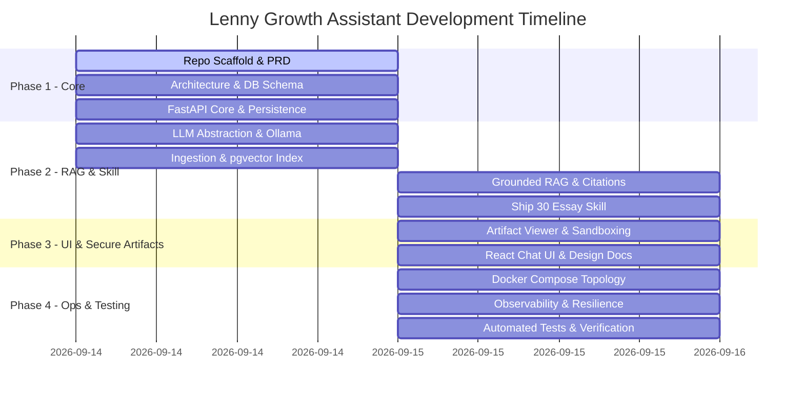

# Product Requirements Document (PRD): Lenny Growth Assistant

## 1. Primary User & Job-to-be-Done (JTBD)
- **Primary Persona:** Senior Product Manager / Growth Lead / Product Marketer.
- **Context:** The user frequently needs tactical, high-leverage growth strategies, metric frameworks, and hiring/retention playbooks shared by world-class leaders on Lenny's Podcast.
- **Job-to-be-Done:**
  1. **Grounded Q&A:** When planning a growth initiative or writing a product strategy document, the user needs to quickly retrieve verifiable, verbatim-supported insights and episode citations from Lenny's back catalog so they can make data-driven strategy decisions without spending hours re-listening to episodes.
  2. **Content Synthesis (Ship 30 for 30 Essays):** When core strategic insights are gathered, the user wants to automatically transform those grounded answers into a high-impact, skimmable 1,250-word Ship 30 for 30 style essay so they can share actionable frameworks with their team or executive stakeholders.
  3. **Inline Artifact Rendering:** When generating rich text, markdown docs, or interactive HTML prototypes, the user wants to preview them immediately in an isolated side-by-side split pane without navigating away from the chat.

## 2. Measurable Success Metrics
- **Verifiable Citation Rate:** $\ge 95\%$ of assistant responses for grounded queries must contain at least one valid, trace-backed timestamp/episode citation.
- **Retrieval Faithfulness / Hallucination Rate:** $0\%$ out-of-bounds hallucinations when questions fall outside the ingested transcript knowledge base (explicit "Not covered in transcripts" fallback).
- **Time-to-First-Token (TTFT):** $< 1.5\text{s}$ on Cloud LLM mode; $< 3.5\text{s}$ on local Ollama execution mode.
- **Essay Generation Success Rate:** $\ge 90\%$ of generated essays adhere strictly to the 1,250-word count target ($\pm 15\%$) and follow the 4-part Ship 30 structure (Hook, Narrative, Skimmable Headings/Bullets, Single Actionable Takeaway).

## 3. Explicit Assumptions
1. **Transcript Source & Format:** Transcripts are ingested from structured text/JSON/VTT podcast transcripts containing episode metadata (title, episode ID, guest, timestamp offset).
2. **Auth & Multitenancy:** Single-tenant local/internal execution model for this submission. Authentication is omitted to streamline local Docker evaluation; session isolation is managed via UUID session tokens in local storage.
3. **Scale Expectations:** Designed for internal team use (1-10 concurrent users, ~100-500 ingested podcast episodes, up to 50,000 text chunks stored in PostgreSQL with pgvector).
4. **Execution Runtime:** Support both Cloud LLM APIs (Anthropic Claude 3.5 Sonnet / OpenAI GPT-4o) for maximum quality and local Ollama (`llama3.2` or `mistral`) for zero-cost offline privacy.

## 4. Scope & Timebox Decisions

### Included in Submission
- **Full-stack RAG pipeline:** FastAPI backend + PostgreSQL with `pgvector` vector store.
- **Dynamic Provider Abstraction:** Seamless runtime/config toggling between Anthropic, OpenAI, and Ollama with automatic failover.
- **Grounded Conversational RAG Endpoint:** Windowed multi-turn context retention + citation mapping.
- **Ship 30 for 30 Essay Generation Skill:** Dedicated prompt/skill pipeline enforcing word budget, structural rules, and strict grounded attribution.
- **Dual-Pane Chat & Artifact Viewer:** React (Vite) interface featuring split-screen markdown rendering and sandboxed HTML iframe rendering.
- **Single-Command Docker Compose Topology:** One-command bringup for Postgres, Backend, Frontend, and Ollama.
- **Observability & Resilience:** JSON structured logging, dependency healthchecks (`/health`), and automated test suite.

### Explicitly Excluded (& Rationale)
- **Multi-tenant Auth & RBAC:** Excluded to maximize focus on core RAG faithfulness, skill pipeline quality, and security sandboxing.
- **Live Audio Transcription Pipeline (Whisper):** Ingestion assumes pre-formatted transcript text/JSON to keep evaluation setup simple and reliable.
- **Global Web Search Fallback:** Excluded intentionally to maintain strict boundary constraints against hallucination.

## 5. Key User Flows
1. **Grounded Chat Q&A:**
   - User inputs query (e.g., "What is Elena Verna's advice on PLG vs Sales-led motion?").
   - Backend queries `pgvector` for top-$k$ semantic chunks.
   - System builds grounded system prompt $\rightarrow$ LLM Streams answer with clickable episode & timestamp citations.
   - Frontend renders citations in clean expandable cards below response.

2. **Follow-Up Refinement:**
   - User asks clarifying question (e.g., "How does this apply to B2B SaaS under $1M ARR?").
   - System maintains sliding message window, retrieves fresh context if needed, and maintains conversational context.

3. **Ship 30 for 30 Essay Generation:**
   - User requests essay generation via dedicated action button or slash trigger ("Write a Ship 30 essay based on this").
   - Backend executes `Ship30EssaySkill` enforcing hook, structure, bold formatting, single takeaway, and ~1,250 word target.
   - Output triggers `ArtifactViewer` auto-open on the right pane.

4. **Artifact Preview & Source Inspection:**
   - User views generated Markdown or HTML artifact in the right split-pane.
   - Toggle button allows switching between Rendered View and Raw Source View.
   - Sandboxed iframe prevents script execution from accessing app tokens/cookies or origin APIs.

## 6. Acceptance Criteria per Feature

| Feature | Acceptance Criteria |
| :--- | :--- |
| **Session Persistence** | `POST /sessions` creates UUID session; messages persist across reloads in Postgres DB. |
| **Grounded RAG** | Answers strictly quote/reference retrieved context; queries outside domain trigger explicit fallback notice. |
| **Citations** | Every answer item contains expandable source metadata (Episode Name, Timestamp/Chunk ID). |
| **Provider Fallback** | Unreachable cloud provider automatically falls back to Ollama if `OLLAMA_FALLBACK=true`. |
| **Ship 30 Skill** | Essay output includes Hook, Narrative, Headings/Bullets, Single Takeaway, ~1,250 words, formatted as Markdown artifact. |
| **Artifact Sandboxing** | HTML artifacts render in iframe with strict `sandbox="allow-scripts"` (isolated origin, blocked cookie access, no external network fetch to host domain). |
| **Docker Bringup** | `docker compose up` starts DB, backend, frontend, and Ollama without manual commands. |

## 7. Risks, Trade-Offs & Mitigations

| Risk / Trade-Off | Impact | Mitigation Strategy |
| :--- | :--- | :--- |
| **RAG Hallucination** | User receives inaccurate growth advice attributed to guest. | Enforce system prompt boundary condition: "Answer ONLY using provided chunks. If insufficient, state 'Not covered in transcripts'." |
| **Local Model Latency & Context Limit** | Ollama local models may run slower or truncate long contexts. | Limit context retrieval to top-$k=4$ chunks ($\sim 2,000$ tokens) when running on local provider. |
| **XSS / Data Leakage via Artifacts** | Generated HTML artifacts executing malicious JavaScript or fetching local storage keys. | Render HTML inside isolated iframe with `sandbox="allow-scripts"` and null origin header; sanitize raw HTML via DOMPurify before iframe insertion. |
| **Cloud API Rate Limits / Key Outages** | Anthropic or OpenAI API failure halts application. | Implement runtime `LLMProvider` fallback pattern to switch to Ollama local instance automatically. |

## 8. Implementation Plan & Timeline

